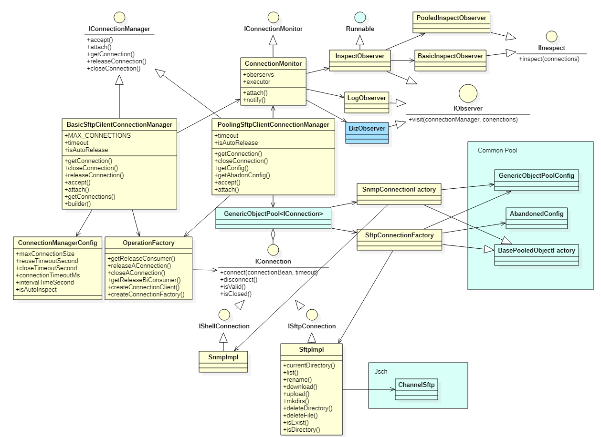

# connection client
Supply basic and pooled management of connections, such as sftp, snmp and so on.

Using common-pool2 as pool manager. Thread safety.

<H2>Functions:</H2>

```
1. Support basic management of connections. Each server host and thread has a connection.

2. Support auto release and shutdown for basic management.

3. Support pooled management of connections.

4. Support extension for multi protocols.
```


<H2>Key parameter:</H2>

```
ConnectionManagerConfig.maxConnectionSize -- The max size of connections all of current process(ClassLoader). Default is 8.

ConnectionManagerConfig.borrowTimeoutMS -- Connection borrow timeout configuration(Millisecond). Default is 1 hour(3600000 ms).If time out, release the connection to reuse.

ConnectionManagerConfig.idleTimeoutMS -- Connection reuse timeout configuration(Millisecond).Default is 5 minutes(300000 ms).If time out, close the connection.

ConnectionManagerConfig.connectionTimeoutMs --  Connect timeout configuration for jsch(Millisecond). Default is 5000 million seconds. If time out, close the connection.

ConnectionManagerConfig.schedulePeriodTimeMS -- The period of schedule(Millisecond). Default is 10 minutes(600000 ms). It's a static parameter.

ConnectionManagerConfig.isAutoInspect -- The switch of inspection. Default true. It's a static parameter.

ConnectionManagerConfig.borrowMaxWaitTimeMS -- The max wait time for borrow connection(millisecond). Default is 1 minute.

```

<H2>Class Design:</H2>


<H2>Getting start:</H2>
Basic manager:

```
IConnectionManager manager = BasicClientConnectionManager.builder()
                .setMaxConnectionSize(8)
                .setAutoInspect(false)
                .setBorrowTimeoutMS(36000)
                .setIdleTimeoutSecond(300000)
                .setSchedulePeriodTimeMS(6000L)
                .setConnectionTimeoutMs(60000)
                .build();
ConnectionBean connectionBean = ConnectionBeanBuilder.builder().port(port).build().getConnectionBean();
try {
    ISftpConnection sftpConnection = manager.borrowConnection(connectionBean, ISftpConnection.class);
    System.out.println(sftpConnection.currentDirectory());
} finally {
    manager.releaseConnection(connectionBean);
    manager.closeConnection(connectionBean);
}
```

Pooled manager:

```
ConnectionBean connectionBean = ConnectionBeanBuilder.builder().port(port).build().getConnectionBean();
IConnectionManager manager = PooledClientConnectionManager.builder()
        .setBorrowMaxWaitTimeMS(8000)
        .build(connectionBean, ISftpConnection.class);
try {
    ISftpConnection sftpConnection = manager.borrowConnection(connectionBean, ISftpConnection.class);
    System.out.println(sftpConnection.currentDirectory());
} finally {
    manager.closeConnection(connectionBean);
}
```